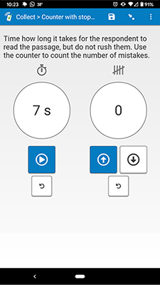

# Counter with stopwatch

## Description

*Requires at least Android 7 or iOS 13 to work in SurveyCTO Collect mobile.*

Use this field plug-in to add a stopwatch and a counter to your field. The stopwatch can display the elapsed time in seconds, deciseconds, centiseconds, and milliseconds. The counter can keep track of the number of occurrences of something. You can reset the current value of either the stopwatch, or the counter, or both. Both values are stored in the form data separated by a space:

`[count] [time (in ms)]`

An answer is not set until the stopwatch is stopped. The value is re-stored whenever the timer is stopped, or when the counter value is changed while the stopwatch is stopped. They can come back and continue where they left off with the same amount of time passed and the same count value.

This field plug-in also inherits functionality from the [baseline-text](https://github.com/surveycto/baseline-text) field plug-in.

## Default SurveyCTO feature support

| Feature / Property | Support |
| --- | --- |
| Supported field type(s) | `text`|
| Default values | Yes |
| Custom constraint message | No |
| Custom required message | No |
| Read only | No |
| media:image | Yes |
| media:audio | Yes |
| media:video | Yes |
| `number` appearance | No |
| `numbers_decimal` appearance | No |
| `numbers_phone` appearance | No |
| `show_formatted` appearance | No |

## How to use

**To use this field plug-in as-is:**

1. Download the [sample form](extras/sample-form) from this repo and upload it to your SurveyCTO server.
1. Download the [counterwithstopwatch.fieldplugin.zip](https://github.com/surveycto/counter-with-stopwatch/raw/master/counterwithstopwatch.fieldplugin.zip) file from this repo, and attach it to the sample form on your SurveyCTO server.
1. Adjust the parameter if you would like to use a different unit (see below).

## Parameters

| Key | Value |
| --- | --- |
| `time-unit` (optional) | This is the unit of time measurement that will be displayed. Possible values are `s` (for seconds), `ds` (for deciseconds), `cs` (for centiseconds), or `ms` (for milliseconds).|

If no parameters are supplied, seconds will be shown by default.

## More resources

* **Sample form**  
[extras/sample-form](extras/sample-form)
* **Developer documentation**  
Instructions and resources for developing your own field plug-ins.  
[https://github.com/surveycto/Field-plug-in-resources](https://github.com/surveycto/Field-plug-in-resources)
* **User documentation**  
How to get started using field plug-ins in your SurveyCTO form.  
[https://docs.surveycto.com/02-designing-forms/03-advanced-topics/06.using-field-plug-ins.html](https://docs.surveycto.com/02-designing-forms/03-advanced-topics/06.using-field-plug-ins.html)